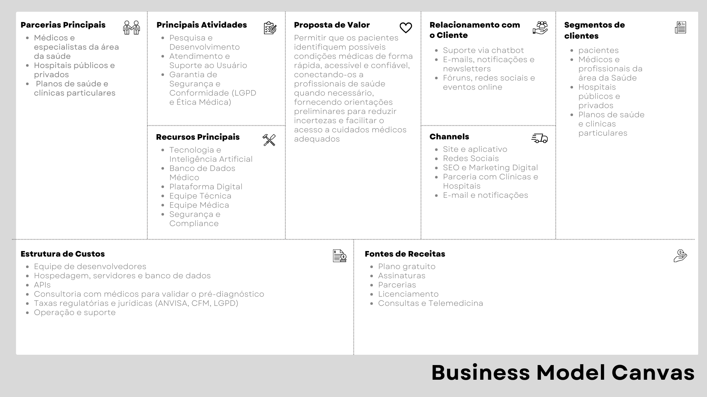

# Introdução ao Projeto
Devemos criar uma startup que envolva tecnologia, incorporando todos os elementos essenciais de uma empresa inovadora.

Este projeto está sendo desenvolvido para do curso de Análise e Desenvolvimento de Sistemas da **Proz Educação**, como parte da **5ª edição** do [Trilhas do Futuro](https://www.trilhasdefuturo.mg.gov.br/), um programa do _Governo do Estado de Minas Gerais_.

**Escola**: [Proz Educação](https://prozeducacao.com.br/) | **Professor**: [Wanderley Lopes Batista](https://capacidadevirtual.blogspot.com/p/curriculo-prof-wanderley_20.html) | **Turma**: 251AM

**Membros do grupo**:
- Cintia
- Mateus & Kauan 
- Stefany
- Ítalo

## O Problema
Hoje muitas pessoas enfrentam longas filas para consultas, enquanto outras sequer procuram ajuda por falta de informação. Isso resulta em diagnósticos tardios e, em muitos casos acaba agravando doenças que poderiam ser prevenidas previamente. Além disso, médicos e hospitais lidam com uma alta demanda, sobrecarregando o Sistema de Saúde dificultando a triagem dos pacientes. Diante disso, criamos uma startup inovadora para transformar o acesso à saúde.

## A Solução
Meu grupo e eu criamos o **Pr**é-diagnóstico **Int**eligente - PrInt, uma plataforma de pré-diagnóstico médico. O PrInt utiliza _Inteligência Artificial_ para fornecer pré-diagnósticos de sintomas e condições de saúde, classificando o risco e conectando os usuários aos especialistas mais adequados de maneira acessível, rápida e eficiente. **Nosso objetivo é facilitar a detecção precoce de doenças, otimizar a triagem médica, reduzir filas e melhorar a eficiência do sistema de saúde**.

    

 

## Pesquisa de Mercado
A busca por informações médicas na internet é uma prática amplamente difundida entre os brasileiros. De acordo com uma pesquisa realizada pelo Minuto Saudável, [94,4% dos internautas no Brasil procuram informações de saúde online](https://santeconsulting.com.br/saude-na-internet/), sendo que a maioria dessas consultas está relacionada a sintomas, tratamentos de doenças, medicamentos e bulas.

Além disso, um estudo mais recente destaca que [90% dos pacientes buscam informações sobre saúde na internet](https://medicinasa.com.br/doctoralia-medsa26/), chegando às consultas já com de dados obtidos em suas pesquisas.

No entanto, essa prática pode levar a diagnósticos incorretos, automedicação perigosa ou atrasos na procura por atendimento médico adequado. Para enfrentar esses desafios, diversas startups têm desenvolvido soluções baseadas em inteligência artificial para auxiliar na triagem e pré-diagnóstico médico. A [Mediktor](https://www.oreporterregional.com.br/noticia/79664/mediktor-adquire-a-sensely-e-consolida-sua-posicao-como-lider-em-solucoes-de-saude-baseadas-em-ia), por exemplo, é um chatbot médico avançado que orienta os pacientes ao nível adequado de cuidados no momento certo, melhorando o acesso e possibilitando uma navegação mais eficiente pelos serviços de saúde.

Outra iniciativa é a [InformAI](https://blog.dsacademy.com.br/8-startups-de-ia-que-estao-revolucionando-a-area-de-saude/), que foca em produtos de IA que aceleram o diagnóstico médico no ponto de atendimento e melhoram a produtividade dos radiologistas.

Essas soluções visam fornecer informações mais precisas e personalizadas aos usuários, reduzindo os riscos associados à automedicação e melhorando a eficiência dos serviços de saúde. No entanto, é essencial que essas ferramentas sejam desenvolvidas em conformidade com as regulamentações de saúde e privacidade de dados, garantindo a segurança e a confiabilidade das informações fornecidas aos pacientes.

## Público Alvo
Nossa startup atende pessoas que buscam informações médicas confiáveis antes de procurar por um atendimento médico. Utilizamos **inteligência artificial** para fornecer um pré-diagnóstico de sintomas e condições de saúde, classificando o risco e conectando os usuários aos especialistas mais adequados de maneira fácil, acessível, rápida e eficiente.

**Nosso Público**:
- Pessoas que buscam entender sintomas antes de procurar um hospital.
- Pais e responsáveis que precisam avaliar sintomas de crianças e idosos rapidamente.
- Hospitais públicos e privados, planos de saúde e clínicas que buscam otimizar atendimentos e reduzir os custos de operação.

Com essa solução, ajudamos a população a tomar decisões mais seguras e melhoramos a eficiência do sistema de saúde.

## Persona
### Definição

Uma persona é a representação fictícia do seu cliente ideal, baseada em dados reais sobre comportamento, dores, necessidades e hábitos. Diferente do público-alvo, que é mais amplo, a persona é detalhada, incluindo nome, idade, profissão, estilo de vida e desafios específicos.

    
  
**Nome**: Mariana Souza    
**Idade**: 23 anos    
 **Profissão**: Assistente Administrativo    
**Localização**: Belo Horizonte - MG  

### O Problema de Mariana
Mariana Souza, 23 anos, sofreu por meses com dores de cabeça, tonturas e náuseas, mas acreditava que era apenas estresse. Com medo de um diagnóstico grave, adiou a busca por ajuda médica.

Até que um dia passou mal e foi levada ao hospital. O diagnóstico foi devastador: tumor cerebral de [nível 4 (OMS)](https://venceonco.com.br/entenda-os-estagios-do-cancer/). Um problema que poderia ter sido identificado e tratado antes, mas a falta de informação a impediu de agir a tempo.

### Como Mariana Usaria a Nossa Plataforma?
Se Mariana tivesse acesso à uma plataforma como a nossa, ela poderia registrar seus sintomas, como dores de cabeça e tontura, e receber uma análise precisa com base em dados médicos confiáveis. A plataforma alertaria sobre a gravidade da condição e a recomendaria a procurar ajuda médica imediatamente. Com orientações claras, ela teria agido mais rápido, aumentando as chances de um tratamento eficaz e evitando complicações.

## Bussiness Model Canvas
